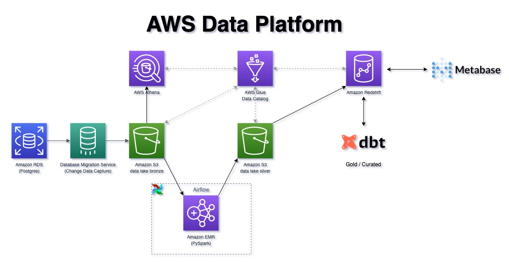

# Project: Data Platform on AWS

**Project Description**: An e-commerce company wants to leverage its data in their business decisions. In order to achieve this, the company wants to build a cloud-based data platform that would enable data analysts and other employees to make data-based decisions more easily.  
As their data engineer, I was tasked with building an ELT (Extract, Load and Transform) pipeline that extracts the company's data from an PostgreSQL database. The data will be saved into a data lake, partitioned and compressed, then modeled into curated tables and served by a cloud-based data warehouse.  
This will create a single source of truth which will make data usage and reporting much more reliable across the company, while also relieving the load on the production database.

### Data Platform Architecture



The focus of our project is implementing the above infrastructure in a testable and replicable way. In order to achieve this, we make use of Infrastructure as Code (IaC), by declaring the components using `AWS CloudFormation/CDK` and `dbt`.  
The data flows as follows:  
1. A `Database Migration Service` replication task is created to load the data from the PostgreSQL database into an `S3 datalake bronze/raw` bucket.
2. `PySpark` jobs will run on an `EMR` cluster, managed with `Airflow`. These jobs will partition and compress the _raw_ data into the `S3 datalake silver/staged` layer.
3. We create a `Glue Data Catalog` that stores metadata about the data contained in the _bronze_ and _silver S3 buckets_. The metadata is kept up-to-date by `Glue Crawlers` that run on a schedule.
4. `Amazon Athena` is configured in order to be used by more experienced data engineers, analysts and scientists that might want to access _raw_ data.
5. The `data warehouse` cluster is created in `Amazon Redshift`, and will hold the curated tables and views for general consumption.
6. `dbt` is used to transform, standardize and model the company's data with SQL, creating a documented single source of truth.
7. We can then plug a BI tool to our data warehouse and start exploring and sharing visualizations and reports.  

## Data

The dataset is available in this [Kaggle](https://www.kaggle.com/olistbr/brazilian-ecommerce?select=olist_orders_dataset.csv) repository.


It is composed by 8 _.csv_ files, that represent a sample snapshot of the production databases, that run in a _microservices_ architecture.
The tables _olist_orders_dataset_ and _olist_order_items_dataset_ compose what would be, to some extent, equivalent to a _fact table_ in a Star Schema, while the other tables serve as _dimension tables_.

## Methodology


## Project directory structure


## How to run this project 

### Disclaimer

**IMPORTANT!**
- **RUNNING THIS PROJECT ON AWS MAY RESULT IN AWS CHARGES**. Even though I tried to keep the project within [AWS Free Tier](https://aws.amazon.com/free/) services, I do not guarantee it won't incur in charges for your account.  
- **PLEASE MAKE SURE YOU DELETE THE CREATED AWS RESOURCES AFTER USAGE**
- **I AM NOT TO BE HELD RESPONSIBLE FOR INCURRED COSTS IN AWS BILLING IF YOU DECIDE TO RUN THE PROJECT IN YOUR OWN ENVIRONMENT**  

This project is set up like a standard Python project. After cloning this repo, start by creating a virtual environment.

To manually create a virtualenv on MacOS and Linux:

```
$ python3 -m venv .venv
```

In order to create the virtualenv, it assumes that there is a `python3`executable in your path with access to the `venv`
package


After the init process completes and the virtualenv is created, you can use the following
step to activate your virtualenv.

```
$ source .venv/bin/activate
```

Once the virtualenv is activated, you can install the required dependencies.

```
$ pip install -r requirements.txt
```

Make sure you also have [AWS CLI](https://docs.aws.amazon.com/cli/latest/userguide/cli-chap-install.html) and [AWS CDK](https://docs.aws.amazon.com/cdk/latest/guide/getting_started.html) installed, and a valid [AWS account configured](https://docs.aws.amazon.com/cli/latest/userguide/cli-configure-files.html).

Now, you can issue the following commands in order to deploy the AWS Stack/Infrastructure.

```
$ make deploy-production
```

## Improvements

- Use PySpark Streaming + Delta Lake/Apache Hudi: This would make ingestion to datalake silver layer more robust.
- Ingest events with Kafka or Kinesis
- Model data as star schema in dbt, instead of using OBT.