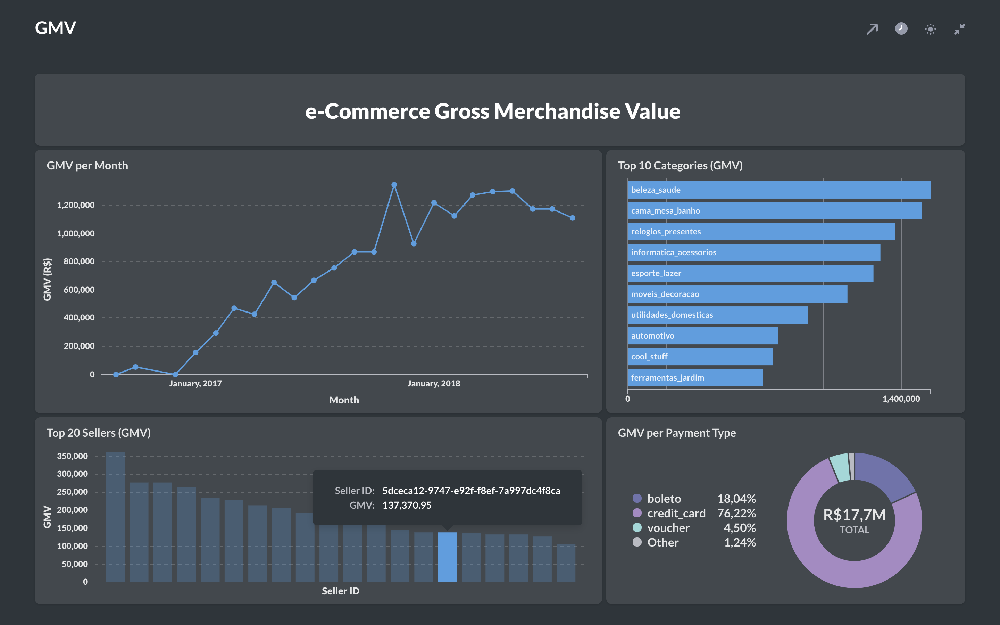
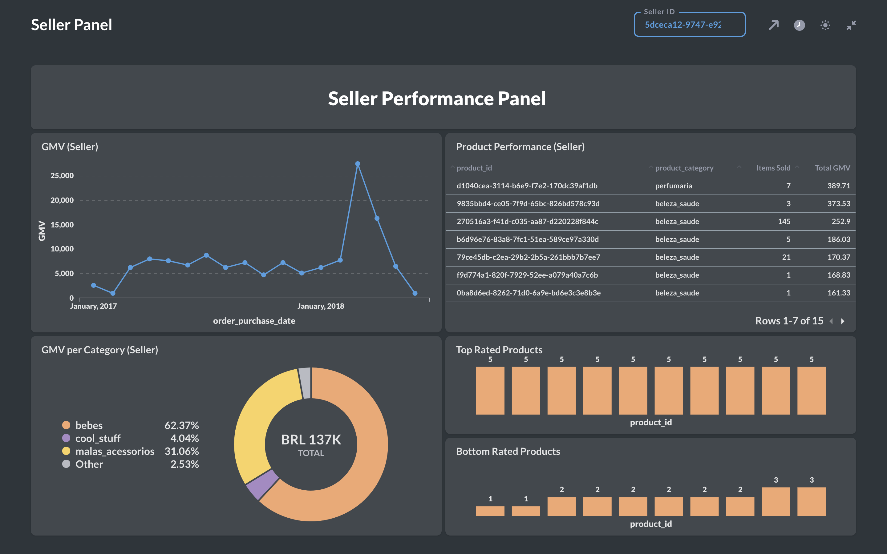

## BI Tool

Now it is time to visually explore our data and share some insights. You can connect to the ``AWS Redshift`` data warehouse with any BI tool of your choice.  
In our project, we make use of [Metabase](https://www.metabase.com/), an open-source BI tool, due to its setup simplicity.  

### Run Metabase Locally

In a production environment, we would properly host our BI tool in a remote server. For our purposes, however, we will run our tool locally. 
Make sure you have [Docker](https://docs.docker.com/engine/install/) installed and configured.

```
$ docker login
$ docker run -d -p 3000:3000 --name metabase metabase/metabase
```

On your browser, open ``localhost:3000``, go through Metabase setup procedure and explore the data!

Below you can find a few simple visualizations that were created by using the ``orders_obt`` table defined with ``dbt``.





